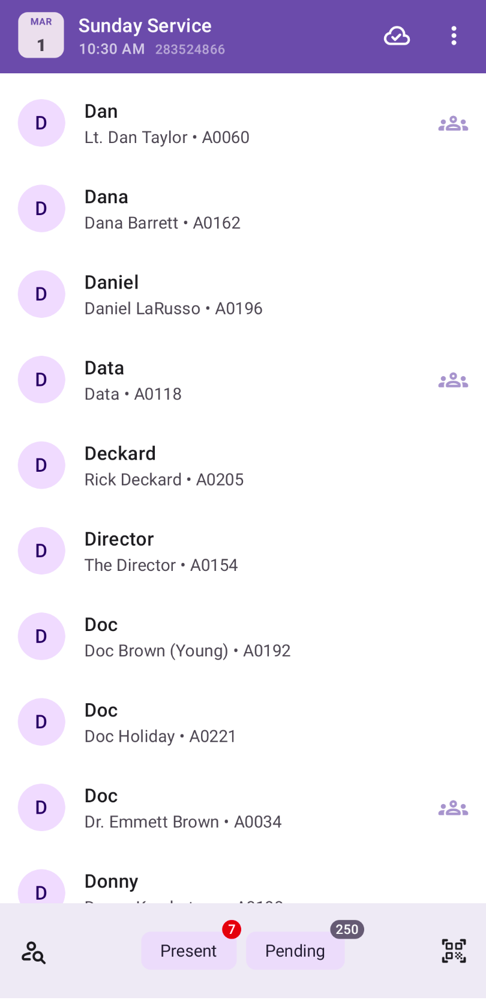
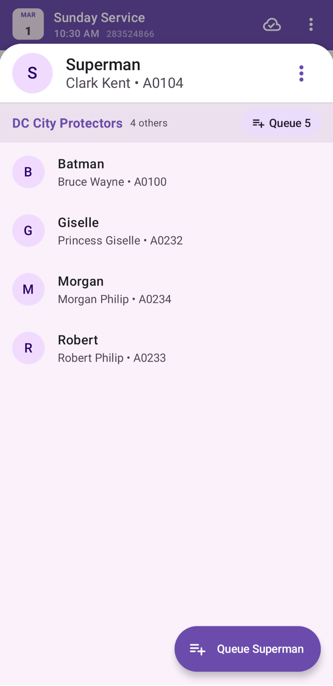
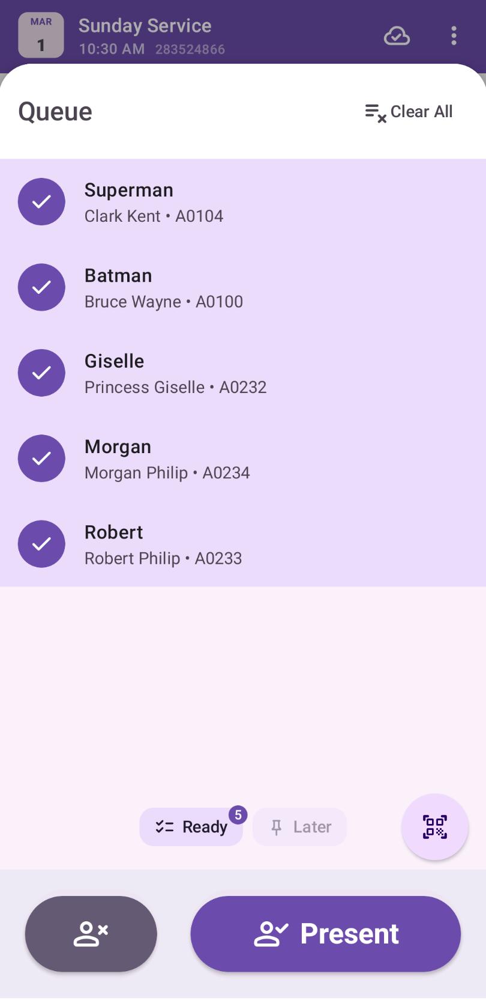
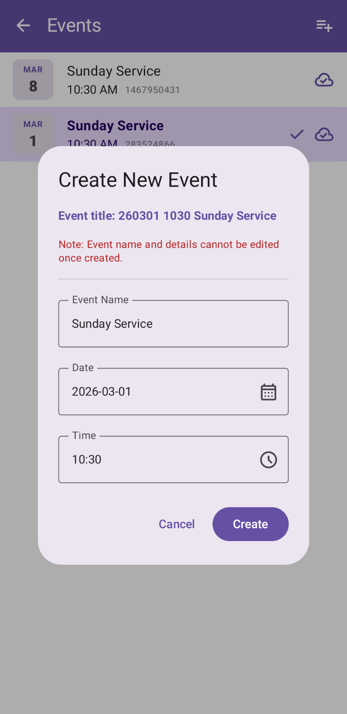
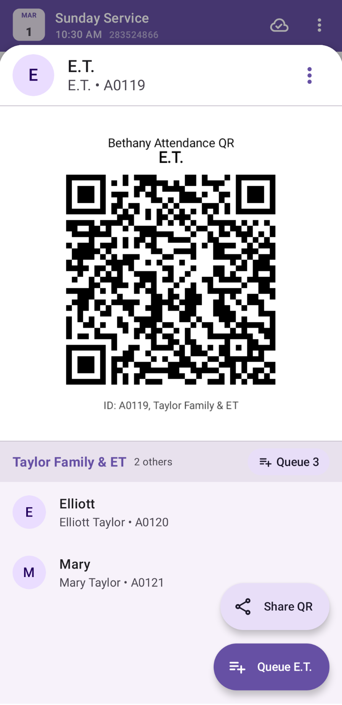

# Attendance - User Guide

This guide explains how to use the Attendance application to efficiently track attendees for BCC events.

    

## Features Overview
*   **Offline-First**: Track attendance instantly, even without an internet connection.
*   **Queue-Based Marking**: Add attendees to a queue for bulk confirmation or set aside for later.
*   **QR Scanning**: Rapidly identify individuals or entire groups using generated QR codes.
*   **Bulk Group Queuing**: Add all members of a family or cell group with a single tap.
*   **Intelligent Search**: Find people quickly with fuzzy search that prioritizes short names.
*   **Event Management**: Easily switch between services or create new events on the fly.
*   **Cloud Sync**: Automatic synchronization with Google Sheets with built-in conflict resolution.
*   **Accessible UI**: Support for text scaling via simple pinch-to-zoom gestures.

## 1. Core Workflow: Add to Queue & Action

The application follows a **Queue-First** approach. Instead of marking people directly, you add them to a "Pending Queue" and then confirm the entire batch when ready.

### Adding Attendees to the Queue
There are several ways to add attendees to your queue:

1.  **Individual Add**:
    *   Find an attendee in the main list.
    *   Tap their name to open the **Attendee Detail Sheet**.
    *   Tap the **Add to Queue** FAB ( `ic_playlist_add`).

2.  **Group Add (Bulk)**:
    *   Within an **Attendee Detail Sheet** (the attendee profile), if the person belongs to any groups, you will see a list of those groups.
    *   Tap the **Queue [Count]** button next to a group name to add all members of that group to your queue at once—perfect for families or teams arriving together.

3.  **Selection Mode (Bulk Add)**:
    *   Tap an attendee's **Avatar (Circle)** to enter selection mode.
    *   Select multiple attendees.
    *   Tap the **Add Selection to Queue** FAB ( `ic_playlist_add`) at the bottom right. This will replace your current queue with the selection and open the Queue sheet.

4.  **QR Scanning**:
    *   Scan an individual or Group QR code (see [QR Codes](#2-qr-codes-sharing--scanning) section below).

### Managing the Queue
Access the queue by tapping the **Floating Action Button (FAB)** on the main list. The button only appears when items are in the queue or in selection mode. The icon changes dynamically to reflect the current count:
*   **1-9 Items**: `ic_filter_1` to `ic_filter_9`
*   **10+ Items**:  `ic_filter_9_plus`

*   **Toggle Status**: Tap an item to toggle between **Ready** (mark now) and **Later** (keep in queue for a future action).
*   **Remove**: Swipe an item to the left ( `ic_playlist_remove`) and lift your finger to remove it from the queue.

### Performing Actions
At the bottom of the Queue sheet, you have two primary actions. Both require a **1-second hold** to activate (a circular progress border will draw clockwise).

1.  **Mark Present** ( `ic_person_check`):
    *   Hold the primary pill-shaped button.
    *   This commits the "Ready" attendees as **PRESENT** for the current event.
    *   They will disappear from the queue and appear with a **Checked** icon () in the main list.

2.  **Mark Pending (Undo)** ( `ic_person_cancel`):
    *   Hold the smaller circular button on the left.
    *   **Note**: We do not mark people as absent by default. This action is used **only** to undo a wrongly marked presence or to clear a status.
    *   This commits the "Ready" attendees as **ABSENT** to the database, effectively resetting their status.

---

## 2. QR Codes: Sharing & Scanning

QR codes allow for rapid attendee identification and group-based operations.

### Generating & Sharing QR Codes
You can generate QR codes for individual attendees or for entire groups to facilitate quick check-ins.

1.  Open the **Attendee Detail Sheet**.
2.  Within the profile header section at the top, tap the **3-dot Menu** ( `ic_more_vert`).
3.  Choose **Attendee QR** or a specific **Group QR** from the dropdown menu.
4.  A preview will appear below the header. Tap **Share QR** ( `ic_share`) to send the QR as an image.

### Scanning QR Codes
*   Tap the **QR Scanner icon** ( `ic_qr_code_scanner`) on the right side of the bottom bar.
*   Point your camera at a generated QR code.
*   **Attendee QR**: Automatically identifies the individual and adds them to your queue.
*   **Group QR**: Identifies all members of the group and adds the entire list to your queue at once—perfect for families or teams arriving together.

---

## 3. Event Management

The application operates within the context of an **Active Event**. You can switch between events or create new ones via the Events screen.

### Accessing Events
*   Tap the **Event Title** (e.g., "Sunday Service 10:30 AM") in the top app bar to open the Events list.
*   The list shows events occurring within a **30-day window**.

### Selecting an Event
*   Tap any event in the list to switch to it. The main attendance list and summary counts will update immediately.
*   **Auto-Selection**: The app automatically selects the most relevant upcoming or recent event upon launch if no selection exists.

### Creating a New Event
*   Tap the **Add Event** icon ( `ic_playlist_add`) in the top right of the Events screen.
*   The app suggests smart defaults (Upcoming Sunday, 10:30 AM, "Sunday Service").
*   New events are ready for immediate local tracking and will sync to a corresponding cloud worksheet.

### Lifecycle & Purge
*   To keep the device efficient, events and attendance records older than **30 days** are automatically purged from the local database.

---

## 4. Spreadsheet Data Structure

The application synchronizes with Google Sheets. Understanding how the data is structured helps you manage the master list and view reports.

### Master Spreadsheet
This sheet contains the global source of truth for all users and groups. **Note**: Each attendee can belong to **zero or more groups**.

| Worksheet | Columns | Description |
| :--- | :--- | :--- |
| **Attendees** | `ID`, `Full Name`, `Short Name` | The primary list of all possible attendees. |
| **Groups** | `Group ID`, `Name` | List of categories (e.g., **"Pastors"**, **"Bishan Cell"**, **"Matthew & Family"**, **"John & Family"**). |
| **Mappings** | `Group ID`, `Attendee ID` | Defines which attendees belong to which groups. |

### Event Spreadsheets
Each event (like a Sunday Service) is mapped to a specific worksheet named `yyMMdd HHmm Name` (e.g., `260301 1030 Sunday Service`).

**Columns in Event Sheets:**
1.  **Attendee ID (A)**: The unique ID of the person.
2.  **Full Name (B)**: Automatically looked up from the Master Sheet using a formula.
3.  **State (C)**: Either `PRESENT` or `ABSENT`.
4.  **Final (D)**: A formula that identifies the **last recorded action** for a specific ID.
    *   If a person is marked `PRESENT` then later "undone" as `ABSENT`, only the `ABSENT` row will show `TRUE` in the Final column.
5.  **Pushed At (E)**: The exact time the action was performed (synchronized across devices).
6.  **Pushed By (F)**: The email of the user who performed the action.

### Filter Views
The application automatically generates a **Filter View** named **"Final Present Only"** on each event worksheet. When activated, this view hides all "ABSENT" records and any older "PRESENT" records that were later undone, leaving only the final list of attendees marked as present.

---

## 5. Conflict Resolution & Cloud Sync

The app is **Offline-First**. You can mark attendance even without an internet connection.

### Synchronization
*   **Local Commit**: Actions are saved to your device instantly.
*   **Sequential Sync**: A background worker uploads actions to the cloud one by one in the order they were performed.
*   **Last Commit Wins**: If two ushers mark the same person differently, the action with the **most recent timestamp** (synchronized via NTP) will be considered the final state.

### Sync Indicators
*    **Cloud Done**: Everything is synced.
*    **Syncing**: Active upload in progress.
*    **Cloud Alert**: An error occurred (e.g., No Internet, Session Expired). Tap the icon to see details and resolve the issue.

### Resolving Conflicts
If the app detects a discrepancy (e.g., data was added to the sheet manually or from another device), it will reconcile by pulling the latest rows from the cloud. The "Final" column in the spreadsheet ensures that reports only count the most recent action for each person.
